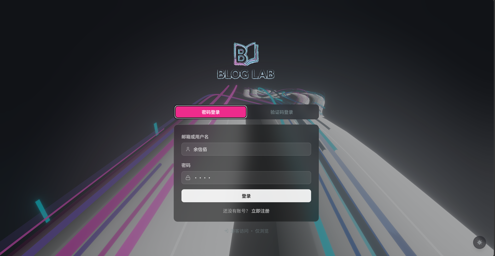
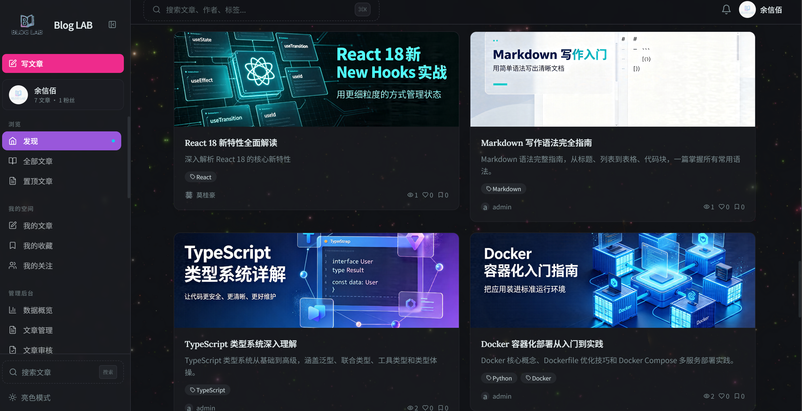
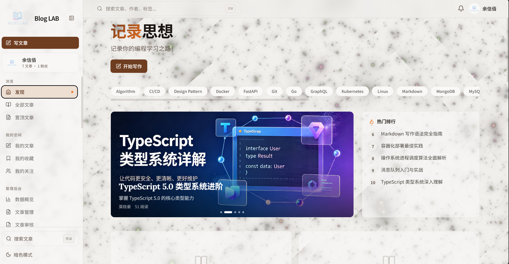
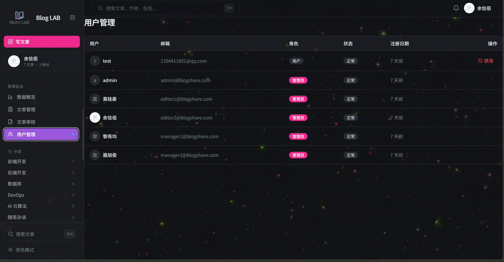

# Blog LAB · 博客知识分享社区

面向小型技术社区的知识管理与分享平台，采用杂志风格 UI 设计，支持多人注册发布文章、Markdown 创作、社交互动与内容管理。前后端分离架构，引入 Redis 缓存层优化高频读写性能。

> **默认暗色模式（霓虹赛博风）**，点击侧栏底部切换亮色。

<p align="center">
  
  <br />
  <em>🔐 登录页 — 手机验证码登录</em>
</p>

<p align="center">
  
  <br />
  <em>📰 主界面 — 文章列表 + 杂志风格卡片 + 动态背景</em>
</p>

<p align="center">
  
  <br />
  <em>☀️ 亮色模式 — 一键切换主题</em>
</p>

<p align="center">
  
  <br />
  <em>👥 团队用户 — 多人协作账号体系</em>
</p>

## 技术栈

| 层级 | 技术 |
| --- | --- |
| 前端 | React 18 + Vite 5 + TypeScript 5 + Tailwind CSS + @uiw/react-md-editor + Three.js + OGL |
| 后端 | Python 3.12 + FastAPI + SQLAlchemy 2.0(async) + Alembic + Pydantic v2 + PyJWT |
| 数据库 | MySQL 8.0（utf8mb4，LONGTEXT 存储 Markdown） |
| 缓存 | Redis 7（RDB+AOF 混合持久化） |
| 部署 | Docker + Docker Compose（MySQL + Redis + FastAPI + Nginx） |

## 功能特性

- 📝 **Typora 风格编辑器** — 沉浸式 Markdown 写作，WPS 风格 Ribbon 工具栏（字体/字号/行距/样式预设）
- 🖼 **封面图管理** — 上传/预览/移除文章封面
- 🏷 **智能分类推荐** — 根据标题关键字自动匹配分类和标签
- 💬 **嵌套评论系统** — 支持回复、点赞、排序（最新/最热/最早）
- ❤️ **互动系统** — 点赞/收藏/分享，统一 interactions 表
- 🔥 **热门排行** — 基于 Redis ZSet 的实时热度计算（浏览量×1 + 点赞×3 + 评论×2 + 时间衰减 + 新鲜度保底）
- 🔎 **全文搜索** — SQL LIKE 搜索标题+内容
- 📌 **文章置顶** — 管理员置顶，侧栏+置顶页展示
- 📰 **RSS 订阅 + Sitemap** — 内容订阅与搜索引擎收录
- 📊 **管理后台** — 数据概览/文章管理/审核/用户管理
- 🌓 **暗色/亮色主题** — 默认暗色霓虹风，一键切换
- ✨ **动态背景** — Galaxy 银河粒子 / Hyperspeed 霓虹高速公路 / LiquidChrome 液态流动
- 📝 **打字机标题** — 首页副标题逐字循环动画
- 👤 **用户系统** — JWT 双 Token 认证 / 手机号绑定 / 关注 / 统计
- 📱 **PWA 支持** — 可添加到主屏幕
- ☁️ **阿里云 OSS** — 可选图片存储后端
- 🛡️ **并发安全** — 唯一约束 + IntegrityError 兜底，防点赞/收藏重复
- 🔗 **请求追踪** — X-Request-ID 贯穿全链路，日志 + 安全头中间件
- 📨 **异步通知** — RabbitMQ 解耦通知投递，点赞/评论/关注不阻塞请求
- ⚡ **列表缓存** — 首页文章列表 Redis 缓存，减少数据库压力

## 项目结构

```
blogshare/
├── client/                 # React 前端
│   ├── src/
│   │   ├── components/     # UI 组件（卡片/侧栏/编辑器）
│   │   ├── features/       # 页面（文章/用户/管理/认证）
│   │   ├── lib/api/        # API 客户端
│   │   ├── store/          # Zustand 状态管理
│   │   └── types/          # TypeScript 类型
│   └── public/             # 静态资源 + Logo
├── server/                 # FastAPI 后端
│   ├── app/
│   │   ├── api/v1/         # 路由（文章/用户/评论/管理/搜索）
│   │   ├── models/         # SQLAlchemy 模型
│   │   ├── services/       # 业务逻辑层
│   │   ├── schemas/        # Pydantic 校验
│   │   ├── core/           # 配置/依赖/安全
│   │   └── tasks/          # 定时任务（排行榜刷新等）
│   └── alembic/            # 数据库迁移
├── nginx/                  # Nginx 反向代理配置
├── redis/                  # Redis 持久化配置
└── docker-compose.yml      # 四服务编排
```

## 本地开发

### 前置要求

- Node.js 20+ / npm
- Python 3.12+
- MySQL 8.0 + Redis 7（或直接用 Docker Compose 启动）

### 1. 启动基础设施

```bash
cp .env.example .env
docker compose up -d db redis
```

### 2. 启动后端

```bash
cd server
pip install -r requirements.txt
# 初始化数据库表 + 种子数据
python -m app.seed
# 启动服务（--reload 开发模式）
python -m uvicorn app.main:app --reload --port 8000
```

后端 API 文档：http://localhost:8000/api/docs

### 3. 启动前端

```bash
cd client
npm install
npm run dev
```

前端：http://localhost:5173（已配置 `/api` 代理到后端 8000）

### 4. 测试账号

| 账号 | 密码 | 权限 | 说明 |
|------|------|------|------|
| `admin` | `1234` | **超级管理员** | 全权限 |
| `莫桂豪` | `1234` | 管理员 | 文章管理 |
| `余信佰` | `1234` | 管理员 | 文章管理 |
| `黎亮均` | `1234` | 管理员 | 文章管理 |
| `扈旭俊` | `1234` | 管理员 | 文章管理 |
| `test` | `1234` | 普通用户 | 测试用 |

## Docker 部署

```bash
cp .env.example .env       # 修改密码与 JWT_SECRET_KEY
docker compose up -d --build
```

## 数据库表结构

| 表 | 说明 |
| --- | --- |
| users | 用户（含角色/状态/超级管理员） |
| articles | 文章（含置顶/状态/浏览量） |
| categories | 分类 |
| tags + article_tags | 标签（多对多） |
| comments | 嵌套评论 |
| interactions | 统一互动（点赞/收藏/分享） |
| follows | 关注关系 |
| notifications | 通知 |

## FastAPI vs Flask — 为什么选择 FastAPI

| 维度 | FastAPI | Flask |
|------|---------|-------|
| **性能** | 异步原生（async/await），基于 Starlette，吞吐量高 | WSGI 同步，需要额外挂载异步扩展 |
| **请求验证** | Pydantic 自动校验请求/响应类型，生成 OpenAPI 文档 | 需手动验证或集成 marshmallow |
| **API 文档** | 自动生成 Swagger UI + ReDoc，零配置 | 需集成 flasgger 等第三方 |
| **类型提示** | 原生支持 Python 类型注解，IDE 自动补全友好 | 无内置类型校验 |
| **依赖注入** | 内置 Depends 系统，声明式管理依赖 | 需手动处理或使用 flask-injector |
| **并发** | 异步协程，单进程高并发，适合 IO 密集型场景 | 同步阻塞，需配合 Gunicorn + gevent |
| **社区生态** | 相对年轻，但增长迅猛，适合新项目 | 成熟稳定，插件丰富 |
| **学习曲线** | 需要理解 async/await 和类型注解 | 简单直观，上手快 |
| **适用场景** | 高并发 API、实时应用、微服务 | 传统 Web 应用、中小型项目、快速原型 |

### 本项目选择 FastAPI 的原因

1. **异步数据库**：SQLAlchemy 2.0 async session + aiomysql，不阻塞事件循环
2. **自动文档**：每个接口自动生成 Swagger 文档，前端对接零沟通成本
3. **Pydantic v2**：请求校验 + 序列化一站式解决，减少样板代码
4. **Depends 系统**：`get_current_user` / `require_admin` 等依赖声明式注入，清晰可测
5. **高性能**：与 Redis 异步客户端配合，排行榜/点赞等高频操作不阻塞

## 用到的 Skills / 工具链

| Skill | 用途 |
|-------|------|
| FastAPI + SQLAlchemy 2.0 async | 后端异步 API + ORM |
| Redis | 缓存 / 排行 ZSet / 限流 / Token 黑名单 / 原子自增 + SET NX 去重 |
| MySQL 8.0 | 持久化存储（utf8mb4 + LONGTEXT + 唯一约束防并发） |
| React 18 + TypeScript | 前端 SPA |
| TanStack Query (React Query) | 服务端状态管理 / 缓存 / 自动刷新 |
| Zustand | 客户端状态（Auth / UI / 主题） |
| React Router v6 | 路由 + 懒加载 |
| Tailwind CSS 3 | 原子化样式 + 暗色模式 |
| Three.js + OGL | WebGL 动态背景（Galaxy / Hyperspeed） |
| Recharts | 管理后台数据图表 |
| GSAP | 打字机动画 |
| face-api.js | 人脸追踪（GridScan 组件） |
| postprocessing | Bloom / 色差特效 |
| Axios | HTTP 客户端 + 401 自动刷新拦截器 |
| Pydantic v2 | 请求/响应校验 + OpenAPI 文档 |
| PyJWT | 双 Token 认证（access + refresh） |
| Alembic | 数据库迁移 |
| Docker + Docker Compose | 容器化部署（含 RabbitMQ 编排） |
| aio-pika + RabbitMQ | 异步消息队列 / 通知解耦 |
| oss2 | 阿里云 OSS 存储（可选） |

## 优化与改进记录

### 数据库层面
- **统一互动模型**：将原来的 `likes` + `favorites` + `comment_likes` + `shares` 四张表合并为一张 `interactions` 表，通过 `target_type` + `action` 区分，减少 4 张表 → 7 张业务表
- **MySQL IN+LIMIT 问题**：MySQL 8.0 不支持 `IN (子查询)` 配合 `LIMIT`，相关查询改写为 JOIN + GROUP BY + HAVING
- **自引用模型修复**：`Comment → replies → Comment` 嵌套关系改用一次 SQL 查询扁平化 + 内存构建树，避免 ORM selectinload 自引用 identity map 错乱

### 性能层面
- **浏览量防刷**：匿名用户按 IP 去重（5 分钟窗口），登录用户按 user_id 去重
- **热门排行新鲜度保底**：新文章即使 0 浏览也有 10 分基础分 × 时间衰减，确保新内容能上榜
- **列表缓存**：首页文章列表 Redis 缓存，减少数据库查询

### 安全层面
- **JWT 过期处理**：修复 `get_current_user_obj` 未捕获 `jwt.PyJWTError` 导致 500 而非 401 的问题
- **Token 刷新错位**：Axios 拦截器刷新 token 后重新调用 `/auth/me` 同步用户信息，修复 refresh cookie 与 store 用户不一致
- **管理员权限分级**：普通管理员可禁用用户但不能操作其他管理员；超管可删除用户、设管理员

### 并发安全层面
- **interactions 唯一约束**：为点赞/收藏/分享表添加 `UNIQUE(user_id, target_id, target_type, action)` 联合唯一约束，配合 `IntegrityError` 异常捕获，双重保障防重复写入
- **Slug 并发兜底**：同名文章并发创建时捕获唯一约束冲突，自动重试生成带后缀的 slug，替代原先的 500 错误
- **Redis 连接加固**：配置 socket 超时（5s/10s）、自动重试和健康检查，避免 Redis 故障时请求挂死
- **缓存层防护**：空值缓存短 TTL 防穿透，TTL ±20% 随机抖动防雪崩

### 前端体验
- **编辑器**：从基础 Markdown 文本域升级为 Typora 风格 WYSIWYG + WPS Ribbon 工具栏（字体/字号/行距/样式预设）
- **主题**：默认暗色模式 → 霓虹赛博配色，点击切换亮色
- **动态背景**：集成 Three.js WebGL 组件（银河粒子 / 霓虹高速公路 / 液态流动）
- **玻璃质感**：卡片使用 `backdrop-filter: blur()` 半透毛玻璃效果
- **打字机标题**：首页副标题 GSAP 逐字动画循环
- **封面图**：文章封面上传/预览/移除，文章详情页顶部展示
- **文章卡片**：固定封面高度 180px，无封面显示渐变占位，所有卡片对齐
- **悬浮效果**：卡片/导航上浮 + 阴影，统一交互反馈

### 开发工程化
- **Vite 代理**：添加 `/uploads` 代理配置，修复本地开发图片裂图
- **Git 排除**：完善 `.gitignore`，排除 IDE / 密钥 / 模型权重 / 日志 / 编译产物
- **数据库精简**：11 张业务表 → 7 张，去除 archive 归档接口
- **中间件体系**：请求追踪 ID（全链路串联） + 访问日志（方法/状态/耗时） + 安全响应头（X-Frame-Options/X-Content-Type-Options）
- **RabbitMQ 集成**：通知系统从同步写 DB 改造为异步消息队列，5 条通知链路（点赞/收藏/评论/回复/关注）全部异步投递
- **列表缓存**：首页文章列表接入 Redis 缓存（仅缓存首屏 ID + 游标），翻页查 DB，缓存自动失效
- **详情缓存**：slug→id 映射缓存（TTL 1h），绕过 slug 查询直接用主键索引
- **连接池监控**：`get_db()` 注入时检查连接池水位 ≥80% 时打印 warning

## 项目简历模板

以下内容可直接用于简历 / 作品集：

---

### Blog LAB — 全栈知识分享社区

**项目简介：** 面向技术社区的知识管理与分享平台，支持多人注册发布文章、Markdown 创作、社交互动与后台管理。杂志风格 UI 设计，默认暗色霓虹赛博主题。

**技术栈：**
- 前端：React 18 + TypeScript + Vite + Tailwind CSS + TanStack Query + Zustand + Three.js
- 后端：Python 3.12 + FastAPI + SQLAlchemy 2.0(async) + Redis + MySQL 8.0
- 部署：Docker + Docker Compose（四服务编排）

**核心职责：**
- 独立完成全栈架构设计与开发，从零搭建前后端项目
- 设计数据库 8 张业务表，实现统一 interactions 互动模型，替代原有的 4 张分散表
- 实现 JWT 双 Token 认证 + 自动刷新机制，解决多标签页 token 同步问题
- 构建 Typora 风格 Markdown 编辑器 + WPS Ribbon 工具栏，支持图片上传与封面管理
- 开发基于 Redis ZSet 的热门排行算法（浏览量×1 + 点赞×3 + 评论×2 + 时间衰减 + 新鲜度保底）
- 实现后台管理系统：数据概览 / 文章 CRUD / 用户管理 / 热门排行手动刷新
- 集成 WebGL 动态背景（Galaxy 银河粒子 / Hyperspeed 霓虹高速公路），支持暗色/亮色主题切换
- 嵌套评论系统（树形结构，支持点赞/排序/删除权限）
- OSS 存储抽象层，支持本地磁盘 / 阿里云 OSS 一键切换
- PWA 支持，可添加到主屏幕
- 设计并发安全体系：DB 唯一约束 + IntegrityError 兜底 + SET NX 原子去重 + 缓存 TTL 抖动防护
- 搭建中间件栈：请求追踪 ID / 访问日志 / 安全响应头 / Redis 限流
- 集成 RabbitMQ 异步消息队列，将 5 条通知链路从同步写 DB 改造为异步投递，消除请求阻塞
- 实现首页文章列表 Redis 缓存 + slug→id 映射缓存，降低数据库查询压力
- 构建 NestJs 风格中间件架构（RequestID → AccessLog → RateLimit → SecurityHeaders），支持全链路日志追踪

**技术亮点：**
- 使用 `selectinload` + 自定义 SQL 优化 ORM 查询，修复 SQLAlchemy 自引用模型 identity map 问题
- 前端无感 Token 刷新：Axios 拦截器自动捕获 401 → 刷新 token → 重试队列
- 评论树手动构建：一次 SQL 查询全部扁平评论 → 内存中构建树，避免 N+1 查询
- 热点排行新鲜度保底：新文章即使 0 浏览也有基础分，确保能进入榜单
- 并发防重复设计：唯一约束 + IntegrityError 捕获的乐观模式，替代悲观锁，兼顾性能与数据一致性
- 缓存全链路防护：击穿（SET NX 锁） + 穿透（空值短 TTL） + 雪崩（TTL 随机抖动）

---

## 后期规划与 AI 接入建议

### 1. AI 智能助手集成

| 功能 | 方案 | 优先级 |
|------|------|--------|
| **文章 AI 摘要** | 调用 LLM API 自动生成文章摘要/导读，存入 `articles.excerpt` | ⭐⭐⭐ |
| **智能标签推荐** | 基于文章内容 embedding，自动匹配分类 + 标签（当前已有关键词匹配雏形） | ⭐⭐⭐ |
| **AI 写作助手** | 编辑器内嵌 AI 续写/润色/翻译功能，StreamingResponse SSE 流式输出 | ⭐⭐⭐ |
| **知识库问答** | 将已发布文章做 embedding → 存入向量数据库 → 用户提问时 RAG 检索回答 | ⭐⭐ |
| **评论审核** | 自动检测评论中的垃圾/违规内容，标记或拦截 | ⭐⭐ |
| **个性化推荐** | 基于用户浏览/点赞历史，embedding 相似度推荐相关文章 | ⭐⭐ |

**技术选型建议：**

```python
# 后端预留了 AI 扩展入口
app/api/v1/chat.py          # 对话接口
app/services/llm_service.py  # LLM 调用封装
# 可选向量库：Qdrant / Milvus / Chroma（本地轻量）
```

- LLM 推荐：OpenAI GPT-4o / Claude 3.5 Sonnet / 本地部署 DeepSeek
- Embedding 模型：text-embedding-3-small / BGE-large-zh
- 向量数据库：Qdrant（云服务） / Chroma（本地开发）
- RAG 架构：LangChain / LlamaIndex

### 2. 架构改进建议

| 方向 | 建议 | 说明 |
|------|------|------|
| **搜索增强** | 接入 Meilisearch / Elasticsearch | 当前 SQL LIKE 搜索性能差，不支持中文分词 |
| **评论分页** | 超过 50 条评论启用懒加载 | 当前一次性加载全部评论，大文章卡顿 |
| **图片优化** | 接入图片压缩 + WebP 转换 | 上传原图过大，影响加载速度 |
| **CDN** | 静态资源 + 图片走 CDN | 减少服务器带宽压力 |
| **消息推送** | WebSocket / SSE 实时通知 | 当前需刷新才能看到新通知 |
| **单元测试** | 后端 pytest + 前端 Vitest | 当前零测试，关键接口缺少回归保障 |
| **CI/CD** | GitHub Actions 自动化测试 + 部署 | 当前手动部署 |
| **国际化** | i18n 多语言支持 | 当前仅中文 |
| **Sentry 监控** | 接入错误追踪 | 当前无线上错误告警 |
| **性能监控** | Prometheus + Grafana | 无接口耗时/QPS 监控 |

### 3. 功能优化建议

- **草稿自动保存**：编辑器每隔 30 秒自动保存到 localStorage，浏览器崩溃不丢内容（已预留 `saveDraft` 函数）
- **文章版本历史**：每次保存生成 diff，支持回滚到历史版本
- **社交登录**：GitHub / Google OAuth 一键登录
- **移动端适配**：侧栏自动折叠为底部导航栏
- **文章导出**：支持导出 PDF / 批量导出 ZIP
- **阅读统计**：用户年度阅读报告，统计阅读时长/文章数/标签分布
- **邮件通知**：评论回复、文章审核结果邮件通知

## License

MIT
